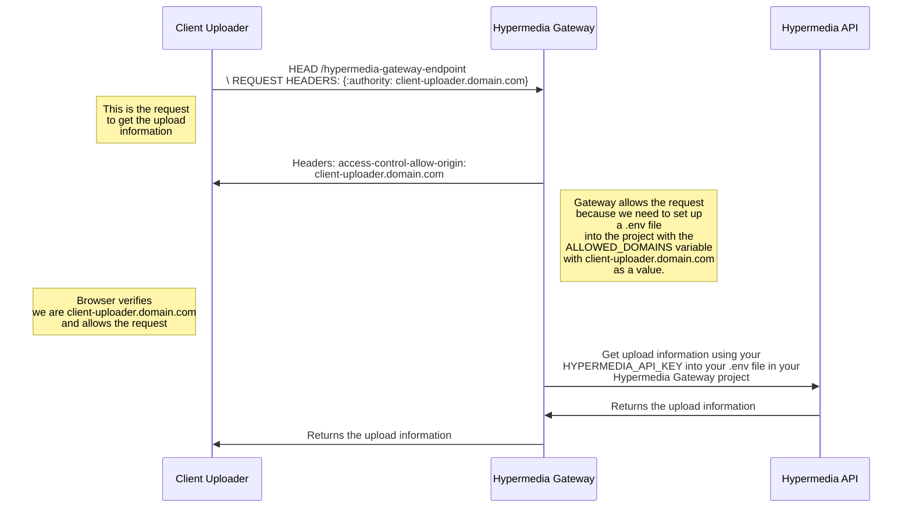

# Client Uploader

Client Uploader is a robust and flexible TypeScript library for handling media file uploads in web applications. Integrating Uppy and tus-js-client, this library simplifies the process of uploading files to your server and provides extensive customization and callback options.

## Features

- **Easy Integration**: Seamlessly adds media file uploading to your projects.
- **Customizable**: Offers various options to control file types, sizes, and the number of files.
- **Progress Tracking**: In-built callback functions to track upload progress.
- **Error Handling**: Robust mechanisms to handle and report errors during uploads.
- **TypeScript Support**: Full TypeScript support for improved development experience.

## Installation

Install Client Uploader via npm:

```bash
npm install @hypermedialabs/uploader
```

or

```bash
yarn add @hypermedialabs/uploader
```

## Usage

First, import the **useHypermediaUploader** function:

```typescript
import { useHypermediaUploader } from '@hypermedialabs/uploader';
```

Then, implement the uploader in your application:

```typescript
const uploader = useHypermediaUploader(endpoint, {
  onProgress: (progress) => console.log(`Upload progress: ${progress}%`),
  onSuccess: (upload) => console.log('Upload successful', upload),
  onError: (error) => console.error('Upload failed', error),
});

// Further implementation...
```

## API Reference

**useHypermediaUploader(endpoint, options)**

- **endpoint**: string - The server endpoint to get upload information. This upload information is **REQUIRED** to upload your video into our servers. We recommend strongly use the [Hypermedia Gateway](https://github.io) to make sure your information is secure from CSRF attacks but you can use any server you want to make the request to our [API](https://api.hypermedia.link/docs) and get the upload information anyway.
- **options**: Object - Configuration options for the uploader.
  - **onError**: function - Callback for upload errors.
  - **onProgress**: function - Callback for tracking upload progress.
  - **onSuccess**: function - Callback for successful uploads.

### How is Hypermedia Gateway's working?



## Contributing

Contributions to Client Uploader are welcome! Please read [Contributing](CONTRIBUTING.md) for details.

## Code of Conduct

All contributors are expected to adhere to the project's Code of Conduct. Please read [Code of Conduct](CODE_OF_CONDUCT.md) before contributing.

## License

Client Uploader is MIT licensed.
